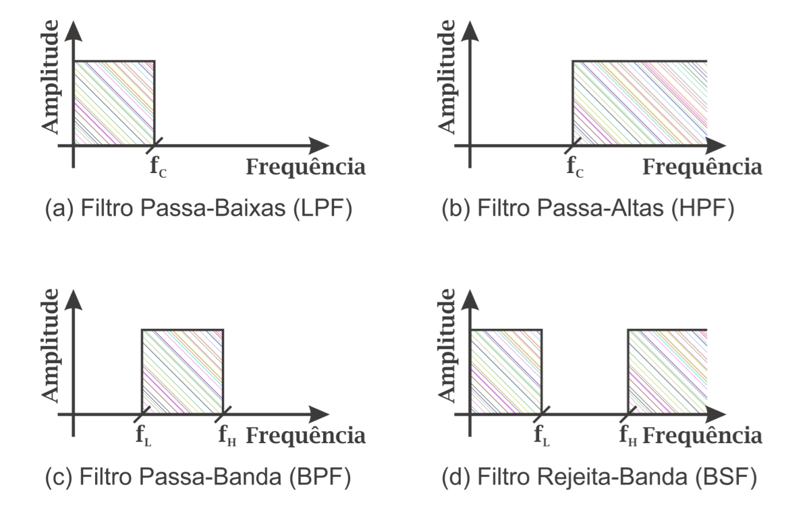
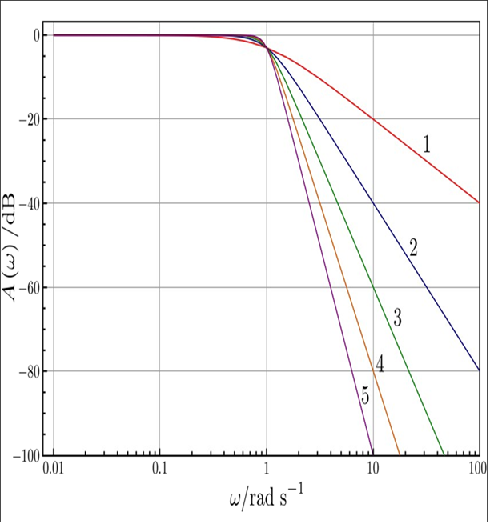
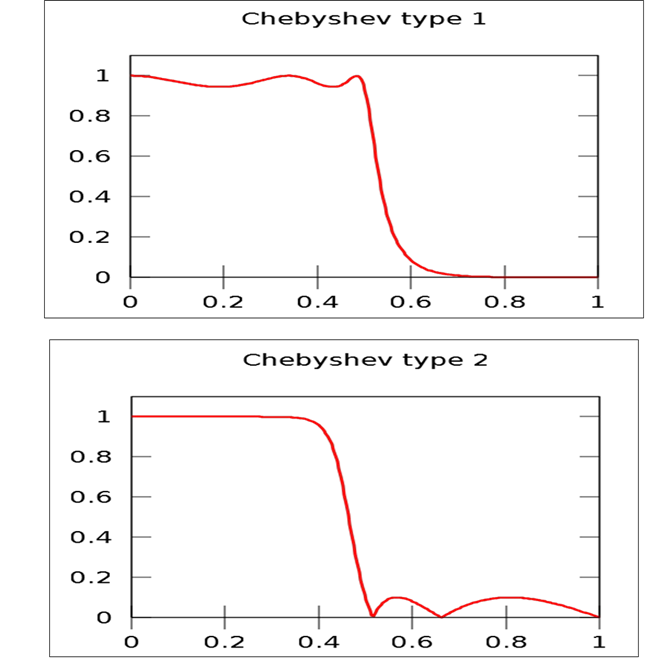
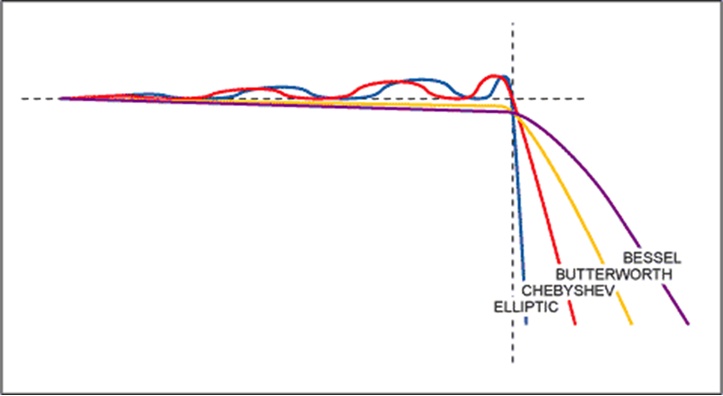
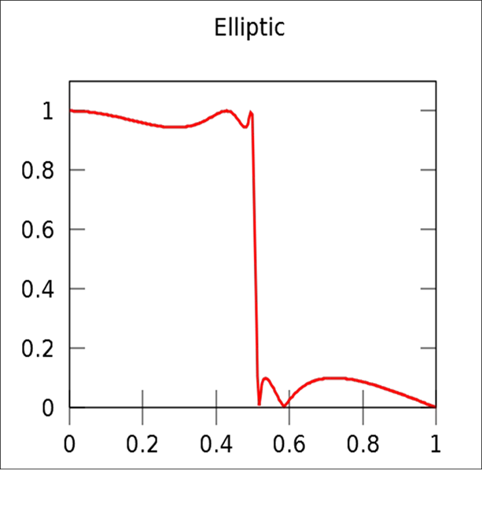

# EININDI - Filtros Analógicos  
**Um guia técnico sobre princípios, classificação, projeto e aplicações**

---

## Sumário

1.  [Introdução](#introdução)
2.  [Classificação dos Filtros Analógicos](#classificação-dos-filtros-analógicos)
    *   [Por Tecnologia](#1-por-tecnologia)
    *   [Por Resposta em Frequência](#2-por-resposta-em-frequência)
3.  [Princípio de Funcionamento](#princípio-de-funcionamento)
4.  [Projeto de Filtros Analógicos](#projeto-de-filtros-analógicos)
    *   [Tipos de Resposta](#tipos-de-resposta)
        *   [Butterworth](#butterworth)
        *   [Chebyshev](#chebyshev)
        *   [Bessel](#bessel)
        *   [Elíptico (Cauer)](#elíptico-cauer)
5.  [Aplicações](#aplicações)
6.  [Estudo de Caso: Do Analógico ao Digital (`main0.cpp`)](#estudo-de-caso-do-analógico-ao-digital-main0cpp)
    *   [Arquitetura Geral](#arquitetura-geral)
    *   [Filtro Digital: Butterworth em Cascata de Biquads](#filtro-digital-butterworth-em-cascata-de-biquads)
    *   [Estruturas de Dados Trocadas entre Tasks](#estruturas-de-dados-trocadas-entre-tasks)
    *   [Medição de Desempenho por Task](#medição-de-desempenho-por-task)
    *   [TaskSampling — Aquisição a 100 Hz](#tasksampling--aquisição-a-100-hz)
    *   [TaskFilter — Filtragem](#taskfilter--filtragem)
    *   [TaskPublish — Publicação via Serial](#taskpublish--publicação-via-serial)
    *   [TaskStats — Monitoramento](#taskstats--monitoramento)
    *   [setup() e loop() — Orquestração](#setup-e-loop--orquestração)
7.  [Referências](#referências)

---

## Introdução

Filtros analógicos são circuitos eletrônicos que processam sinais contínuos para atenuar ou destacar componentes específicos de frequência. Utilizados em áreas como telecomunicações, áudio e instrumentação, eles são implementados com componentes passivos (resistores, capacitores, indutores) ou ativos (amplificadores operacionais). Este documento detalha sua classificação, funcionamento, metodologias de projeto (incluindo Butterworth, Chebyshev, Bessel e Elíptico) e aplicações práticas.

---

## Classificação dos Filtros Analógicos

### 1. Por Tecnologia

*   **Filtros Passivos**:  
    Compostos por resistores, capacitores e indutores. Não requerem fonte de energia externa e são ideais para aplicações de baixa frequência e alta potência.
    Exemplo: Filtro RC passa-baixa.
*   **Filtros Ativos**:  
    Incluem amplificadores operacionais ou transistores, permitindo maior controle do ganho, impedância e resposta em frequências mais altas. Requerem alimentação externa.
    Exemplo: Filtro Sallen-Key.

### 2. Por Resposta em Frequência

| Tipo                  | Função                                                                                           | Aplicações Típicas                                                         |
| :-------------------- | :----------------------------------------------------------------------------------------------- | :------------------------------------------------------------------------- |
| **Passa-Baixa (LPF)** | Permite frequências abaixo da frequência de corte ($f_c$).                                    | Redução de ruído em sistemas de áudio, suavização de sinais.               |
| **Passa-Alta (HPF)**  | Permite frequências acima de $f_c$.                                                           | Eliminação de *DC offset*, acoplamento AC.                               |
| **Passa-Banda (BPF)** | Permite uma faixa específica entre duas frequências de corte ($f_{c1}$ e $f_{c2}$).         | Rádio FM, equalizadores paramétricos.                                     |
| **Rejeita-Banda (BEF)** | Bloqueia uma faixa específica de frequências. Também conhecido como *notch filter*.             | Eliminação de interferência (ex: 60Hz da rede elétrica).                 |
| **Passa-Tudo (APF)**  | Mantém a amplitude do sinal, mas altera sua fase. Usado para correção de fase ou atraso de sinal. | Correção de fase em sistemas de comunicação, emula atrasos em processamento. |


---

## Princípio de Funcionamento

Filtros analógicos operam modificando a relação entre tensão e corrente em função da frequência:

*   **Filtros Passivos**: Usam combinações de impedâncias (ex.: $$Z = R + \frac{1}{j\omega C}$$) para criar atenuação seletiva. A energia é dissipada (em resistores) ou armazenada (em capacitores e indutores).
*   **Filtros Ativos**: Combinam componentes passivos com amplificadores para ajustar ganho e impedância. Permitem maior flexibilidade no projeto, incluindo ganho de sinal e impedâncias de entrada/saída controladas.

A função de transferência $$H(s)$$ de um filtro é crítica para definir seu comportamento.

---

## Projeto de Filtros Analógicos

### Tipos de Resposta

#### Butterworth

*   **Características**:
    *   Banda passante plana (sem ondulações/ripple).
    *   Atenuação gradual: -6n dB/oitava (n = ordem do filtro).
    *   Boa resposta de fase, com menor distorção de sinal.
*   **Função de Transferência** (2ª ordem):
    $$
    H(s) = \frac{\omega_c^2}{s^2 + \sqrt{2}\omega_c s + \omega_c^2}
    $$
*   **Aplicações**: Sistemas de áudio de alta fidelidade, instrumentação, onde a precisão na banda passante é fundamental. 

#### Chebyshev

*   **Características**:
    *   Ondulações (ripple) controladas na banda passante (Tipo I) ou banda de rejeição (Tipo II).
    *   Transição abrupta entre bandas (maior seletividade).
    *   Maior distorção de fase em comparação com Butterworth.
*   **Função de Transferência** (Tipo I):
    $$
    |H(\omega)|^2 = \frac{1}{1 + \epsilon^2 T_n^2(\omega/\omega_c)}
    $$
    onde $$T_n$$ é o polinômio de Chebyshev e $$\epsilon$$ define a amplitude do ripple.
*   **Aplicações**: Telecomunicações, processamento de sinais, onde a seletividade é mais importante que a fidelidade na banda passante. 

#### Bessel

*   **Características**:
    *   Resposta de fase linear na banda passante, ideal para preservar a forma de onda dos sinais (mínima distorção de fase).
    *   Atenuação mais gradual do que Butterworth ou Chebyshev.
    *   Retardo de grupo constante na banda passante.
*   **Função de Transferência**: Os polos são dispostos de forma a maximizar a linearidade da fase. Não há uma forma simples para a função de transferência geral.
*   **Aplicações**: Sistemas de comunicação de dados, processamento de vídeo, onde a integridade do sinal no domínio do tempo é crucial. 

#### Elíptico (Cauer)

*   **Características**:
    *   Ondulações tanto na banda passante quanto na banda de rejeição.
    *   Transição mais rápida (maior seletividade) entre a banda passante e a banda de rejeição em comparação com os outros tipos.
    *   Maior complexidade de projeto e implementação.
*   **Função de Transferência**: Envolve funções elípticas de Jacobi.
*   **Aplicações**: Aplicações que exigem a maior seletividade possível, como sistemas de análise espectral de alta precisão e processamento de sinais de rádio. 

### Comparação de Respostas em Frequência

\[Imagem ou gráfico comparando as respostas de frequência dos filtros Butterworth, Chebyshev, Bessel e Elíptico, mostrando as diferenças em ripple, seletividade e resposta de fase]

### Etapas de Projeto

1.  **Definição de Requisitos**:
    *   Especificar as frequências de corte, atenuação na banda de rejeição, ripple máximo (se aplicável) e tipo de resposta desejada (Butterworth, Chebyshev, Bessel, Elíptico).
2.  **Seleção da Topologia**:
    *   Filtros Passivos: Selecionar entre topologias LC (para alta qualidade e baixa perda) ou RC (para aplicações de baixa frequência).
    *   Filtros Ativos: Escolher entre topologias como Sallen-Key (para filtros de 2ª ordem), Multiple Feedback (MFB) ou outras configurações baseadas em amplificadores operacionais.
3.  **Cálculo dos Componentes**:
    *   Utilizar tabelas de filtros normalizados, software de projeto de filtros ou cálculos manuais para determinar os valores dos componentes (resistores, capacitores, indutores) com base nas especificações do filtro.
4.  **Simulação e Otimização**:
    *   Simular o circuito do filtro em software como SPICE ou LTspice para verificar se a resposta em frequência atende aos requisitos. Otimizar os valores dos componentes, se necessário, para melhorar o desempenho do filtro.
5.  **Implementação e Teste**:
    *   Construir o circuito do filtro em uma placa de circuito impresso (PCB) ou protoboard. Testar o filtro com equipamentos de teste, como analisadores de espectro ou geradores de sinais, para verificar se ele atende às especificações.

---

## Aplicações

1.  **Telecomunicações**:
    *   Filtros Chebyshev ou Elípticos em transmissores e receptores de RF para selecionar canais e rejeitar interferências.
    *   Filtros Bessel para preservar a integridade dos sinais de dados em sistemas de comunicação digital.
2.  **Áudio**:
    *   Filtros Butterworth em equalizadores gráficos e crossovers de áudio para suavizar a resposta em frequência e evitar distorções de fase.
    *   Filtros passa-baixa para eliminar ruídos de alta frequência em sistemas de gravação.
3.  **Instrumentação Médica**:
    *   Filtros para remover ruídos e artefatos de sinais de ECG e EEG.
    *   Filtros passa-alta para remover o *DC offset* e a derivação da linha de base em sinais biomédicos.
4.  **Controle e Automação**:
    *   Filtros para suavizar sinais de sensores e atuadores em sistemas de controle.
    *   Filtros para eliminar ruídos em sistemas de aquisição de dados.

---

## Estudo de Caso: Do Analógico ao Digital (`main0.cpp`)

Tudo o que foi descrito até aqui — Butterworth, ordem, frequência de corte — pode ser implementado **sem nenhum componente eletrônico**, apenas calculando os mesmos polos e zeros em software e aplicando-os amostra a amostra. É exatamente isso que o firmware [`src/main0.cpp`](src/main0.cpp) faz: substitui o filtro Butterworth analógico (RC/LC/Sallen-Key) por um **filtro digital equivalente**, rodando em um ESP32 com FreeRTOS.

A ideia pedagógica desta seção é mostrar, trecho a trecho, como cada conceito teórico do documento vira código real.

### Arquitetura Geral

O sinal passa por um pipeline de 3 tasks (threads do FreeRTOS), cada uma isolada por fila (`queue`), mais uma quarta task de monitoramento:

```
GPIO34 (ADC) → [TaskSampling] --rawQueue--> [TaskFilter] --filteredQueue--> [TaskPublish] → Serial
                                                                  ↑
                                                  [TaskStats] mede tempo/memória de todas
```

*   **TaskSampling**: lê o sinal físico a 100 Hz (equivalente à "entrada" de um filtro analógico).
*   **TaskFilter**: aplica o filtro Butterworth digital (equivalente ao circuito RC/Sallen-Key).
*   **TaskPublish**: envia o resultado pela serial, para visualização em tempo real.
*   **TaskStats**: não existe em um filtro analógico — é a vantagem extra do digital: dá para *medir* o próprio desempenho do processamento.

Cada task roda em paralelo, em núcleos diferentes do ESP32 (dual-core), e se comunica de forma segura via filas, sem que uma trave a outra.

### Filtro Digital: Butterworth em Cascata de Biquads

Na seção [Butterworth](#butterworth) vimos a função de transferência analógica $H(s)$. Para implementá-la digitalmente, ela é convertida (via transformação bilinear) em coeficientes discretos, aplicados em blocos de 2ª ordem chamados **biquads**. Um filtro de 4ª ordem = 2 biquads em cascata:

```cpp
constexpr float SAMPLE_RATE_HZ = 100.0f;   // fs — taxa de amostragem
// Filtro: Butterworth passa-baixa de 4a ordem, fs=100 Hz, fc=20 Hz.
// Coeficientes no formato exigido por dsps_biquad_f32:
// [b0, b1, b2, a1, a2], com a0 = 1.
static float lowpass_stage1_coeffs[5] = {
    0.029058182199822265f,
    0.05811636439964453f,
    0.029058182199822265f,
    -0.5159313372981117f,
    0.1011974058740317f,
};

static float lowpass_stage2_coeffs[5] = {
    1.0f,
    2.0f,
    1.0f,
    -0.7002830914282003f,
    0.49467548859626914f,
};
```

Cada biquad implementa a equação a diferenças:

$$
y[n] = b_0 x[n] + b_1 x[n-1] + b_2 x[n-2] - a_1 y[n-1] - a_2 y[n-2]
$$

que é o correspondente discreto de $H(s)$. Os `stage*_state` guardam $x[n-1], x[n-2]$ (a "memória" do filtro, análoga à energia armazenada em capacitores/indutores de um filtro passivo):

```cpp
static float lowpass_stage1_state[2] = {0.0f, 0.0f};
static float lowpass_stage2_state[2] = {0.0f, 0.0f};

float filterLowpassCascade(float sample) {
    float stage1 = 0.0f;
    float filtered = 0.0f;

    dsps_biquad_f32(&sample, &stage1, 1, lowpass_stage1_coeffs, lowpass_stage1_state);
    dsps_biquad_f32(&stage1, &filtered, 1, lowpass_stage2_coeffs, lowpass_stage2_state);

    return filtered;
}
```

Com $f_c = 20$ Hz e $f_s = 100$ Hz, um sinal de 10 Hz passa quase sem atenuação, enquanto um de 40 Hz é fortemente atenuado — o mesmo comportamento de banda passante/rejeição visto na tabela de [Resposta em Frequência](#2-por-resposta-em-frequência), só que calculado em ponto flutuante a cada 10 ms em vez de moldado por um capacitor.

A leitura do ADC (o "sinal de entrada" do filtro) é feita assim, convertendo contagens de 12 bits em tensão real:

```cpp
constexpr uint8_t ADC_PIN = 34;
constexpr float ADC_MAX_COUNTS = 4095.0f; // 2^12 - 1
constexpr float ADC_REF_VOLTS = 3.3f;

float readAdcVolts() {
    const uint16_t counts = analogRead(ADC_PIN);
    return (static_cast<float>(counts) * ADC_REF_VOLTS) / ADC_MAX_COUNTS;
}
```

### Estruturas de Dados Trocadas entre Tasks

Cada amostra carrega consigo um *timestamp* de alta resolução (`esp_timer_get_time()`, em microssegundos), o que permite medir a latência fim-a-fim do pipeline — algo impossível de "ver" diretamente num filtro analógico, mas trivial num digital:

```cpp
struct RawSample {
    float raw;
    int64_t t_us; // instante da aquisição (esp_timer_get_time), usado p/ latência
};

struct FilteredSample {
    float raw;
    float filtered;
    int64_t t_us;
};
```

### Medição de Desempenho por Task

Um recurso que só existe no domínio digital: cada task registra seu próprio tempo de execução (min/média/max) e overruns (amostras perdidas), protegido por *spinlock* porque é escrito pela própria task e lido pela `TaskStats` em paralelo:

```cpp
struct TaskTiming {
    portMUX_TYPE mux = portMUX_INITIALIZER_UNLOCKED;
    uint32_t lastUs = 0;
    uint32_t minUs = UINT32_MAX;
    uint32_t maxUs = 0;
    uint64_t sumUs = 0;
    uint32_t samples = 0;
    uint32_t overruns = 0; // ex.: fila cheia, amostra descartada

    void record(uint32_t execUs) {
        portENTER_CRITICAL(&mux);
        lastUs = execUs;
        if (execUs < minUs) minUs = execUs;
        if (execUs > maxUs) maxUs = execUs;
        sumUs += execUs;
        samples++;
        portEXIT_CRITICAL(&mux);
    }
    // ...
};
```

### TaskSampling — Aquisição a 100 Hz

Equivalente ao estágio de entrada de um filtro: uma amostra nova a cada 10 ms (`SAMPLE_PERIOD_MS`). `vTaskDelayUntil` garante o período exato, sem deriva acumulada — o análogo digital de um clock estável. Se a fila estiver cheia, a amostra mais antiga é descartada para priorizar o dado mais recente:

```cpp
void taskSampling(void *pvParameters) {
    const TickType_t period = pdMS_TO_TICKS(SAMPLE_PERIOD_MS);
    TickType_t lastWake = xTaskGetTickCount();

    for (;;) {
        const int64_t t0 = esp_timer_get_time();

        RawSample sample;
        sample.raw = readAdcVolts();
        sample.t_us = t0;

        if (xQueueSend(rawQueue, &sample, 0) != pdPASS) {
            // Fila cheia: descarta a amostra mais antiga para manter o dado mais recente.
            RawSample discard;
            xQueueReceive(rawQueue, &discard, 0);
            xQueueSend(rawQueue, &sample, 0);
            samplingTiming.addOverrun();
        }

        const uint32_t execUs = static_cast<uint32_t>(esp_timer_get_time() - t0);
        samplingTiming.record(execUs);

        vTaskDelayUntil(&lastWake, period);
    }
}
```

### TaskFilter — Filtragem

É a task que efetivamente "é" o filtro Butterworth: fica bloqueada esperando uma amostra nova, aplica a cascata de biquads (seção anterior) e repassa o resultado adiante:

```cpp
void taskFilter(void *pvParameters) {
    RawSample sample;

    for (;;) {
        if (xQueueReceive(rawQueue, &sample, portMAX_DELAY) != pdPASS) continue;

        const int64_t t0 = esp_timer_get_time();
        const float filtered = filterLowpassCascade(sample.raw);
        const uint32_t execUs = static_cast<uint32_t>(esp_timer_get_time() - t0);
        filterTiming.record(execUs);

        FilteredSample out{sample.raw, filtered, sample.t_us};
        if (xQueueSend(filteredQueue, &out, 0) != pdPASS) {
            filterTiming.addOverrun();
        }
    }
}
```

### TaskPublish — Publicação via Serial

Envia o par (bruto, filtrado) e a latência fim-a-fim pela serial, no formato *Teleplot*, permitindo visualizar as duas curvas — a "entrada" e a "saída" do filtro — em tempo real, como se estivesse com um osciloscópio de dois canais:

```cpp
void taskPublish(void *pvParameters) {
    FilteredSample sample;

    for (;;) {
        if (xQueueReceive(filteredQueue, &sample, portMAX_DELAY) != pdPASS) continue;

        const int64_t t0 = esp_timer_get_time();
        const uint32_t latencyUs = static_cast<uint32_t>(t0 - sample.t_us);

        xSemaphoreTake(serialMutex, portMAX_DELAY);
        wserial.plot("raw", sample.raw, "V");
        wserial.plot("filtered", sample.filtered, "V");
        wserial.plot("latencia", static_cast<float>(latencyUs), "us");
        xSemaphoreGive(serialMutex);

        const uint32_t execUs = static_cast<uint32_t>(esp_timer_get_time() - t0);
        publishTiming.record(execUs);
    }
}
```

### TaskStats — Monitoramento

A cada 2 segundos (`STATS_PERIOD_MS`), imprime um raio-x do sistema: tempo de execução de cada task, memória de pilha (*stack*) livre, heap livre/mínimo e ocupação das filas — útil para validar que o filtro está rodando dentro do orçamento de tempo (10 ms por ciclo, a 100 Hz):

```cpp
void taskStats(void *pvParameters) {
    const TickType_t period = pdMS_TO_TICKS(STATS_PERIOD_MS);
    TickType_t lastWake = xTaskGetTickCount();

    for (;;) {
        vTaskDelayUntil(&lastWake, period);

        const UBaseType_t rawBacklog = uxQueueMessagesWaiting(rawQueue);
        const UBaseType_t filteredBacklog = uxQueueMessagesWaiting(filteredQueue);

        // imprime uptime, heap livre/mínimo, número de tasks e backlog das filas...
        printTaskLine("sampling", samplingTaskHandle, samplingTiming);
        printTaskLine("filter", filterTaskHandle, filterTiming);
        printTaskLine("publish", publishTaskHandle, publishTiming);
    }
}
```

### `setup()` e `loop()` — Orquestração

É onde as 4 tasks nascem, cada uma fixada (`PinnedToCore`) em um núcleo e com uma prioridade específica. `Sampling` e `Filter` ficam isoladas no core 1 com prioridade mais alta, para preservar o período de amostragem mesmo que WiFi/Bluetooth (que roda no core 0) esteja ocupado:

```cpp
void setup() {
    wserial.begin(SERIAL_BAUD);
    analogReadResolution(12);
    analogSetPinAttenuation(ADC_PIN, ADC_11db);
    pinMode(ADC_PIN, INPUT);

    serialMutex = xSemaphoreCreateMutex();
    rawQueue = xQueueCreate(RAW_QUEUE_LEN, sizeof(RawSample));
    filteredQueue = xQueueCreate(FILTERED_QUEUE_LEN, sizeof(FilteredSample));

    // Sampling e Filter no core 1 (isolados do stack de WiFi/BT no core 0),
    // com a Sampling em prioridade mais alta para preservar o período de 10 ms.
    xTaskCreatePinnedToCore(taskSampling, "Sampling", 2048, nullptr, 3, &samplingTaskHandle, 1);
    xTaskCreatePinnedToCore(taskFilter, "Filter", 3072, nullptr, 2, &filterTaskHandle, 1);

    // Publish e Stats no core 0: não são críticos em tempo, só consomem as filas.
    xTaskCreatePinnedToCore(taskPublish, "Publish", 3072, nullptr, 1, &publishTaskHandle, 0);
    xTaskCreatePinnedToCore(taskStats, "Stats", 4096, nullptr, 1, &statsTaskHandle, 0);
}

void loop() {
    // O trabalho fica todo nas tasks; o loop padrão do Arduino só mantém
    // a serial (comandos/reconexão UDP) e cede tempo de CPU.
    wserial.update();
    vTaskDelay(pdMS_TO_TICKS(10));
}
```

> **Resumo didático**: onde um filtro Butterworth analógico usaria R, L e C escolhidos para posicionar polos no plano $s$, o firmware usa coeficientes `b0, b1, b2, a1, a2` para posicionar os mesmos polos no plano $z$ (discreto) — e troca "componentes físicos que envelhecem e têm tolerância" por "números de ponto flutuante exatos e reconfiguráveis em software", ao custo de precisar de uma CPU rodando em tempo real (por isso o uso do FreeRTOS).

---

## Referências

*   \[Links para recursos adicionais sobre projeto de filtros analógicos, como livros, artigos técnicos, notas de aplicação e software de simulação.]